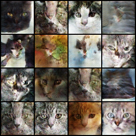
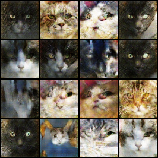

# Generative Models

## Introduction

This repository contains a project developed for the Deep Learning course during the 2024/2025 Summer Semester at the Warsaw University of Technology, Faculty of Mathematics and Information Science.

## Dataset

The dataset can be obtained from various sources, but we recommend using the `fferlito/Cat-faces-dataset` repository.

To download the dataset on Linux, run the following commands:

```bash
wget [https://github.com/fferlito/Cat-faces-dataset/raw/master/dataset-part1.tar.gz](https://github.com/fferlito/Cat-faces-dataset/raw/master/dataset-part1.tar.gz)

wget [https://github.com/fferlito/Cat-faces-dataset/raw/master/dataset-part2.tar.gz](https://github.com/fferlito/Cat-faces-dataset/raw/master/dataset-part2.tar.gz)

wget [https://github.com/fferlito/Cat-faces-dataset/raw/master/dataset-part3.tar.gz](https://github.com/fferlito/Cat-faces-dataset/raw/master/dataset-part3.tar.gz)
````

Extract the downloaded archives into the `cats/images` directory:

```bash
mkdir -p cats/images
tar -xzvf dataset-part1.tar.gz -C cats/images --strip-components=1
tar -xzvf dataset-part2.tar.gz -C cats/images --strip-components=1
tar -xzvf dataset-part3.tar.gz -C cats/images --strip-components=1
```

## Dependencies

To set up the environment on Linux, create a virtual environment and install the required packages:

```bash
python3 -m venv venv
source venv/bin/activate
pip install torch torchvision torchsummary matplotlib
```

## Usage

### 1. Create the directory
First, create the necessary directory to store the trained model weights:

```bash
mkdir -p models/GAN
mkdir -p generated/GAN
```

### 2. Run `main.py`
Run `main.py` to start training process. During the training process intermediate results will be saved under `generated/GAN` directory.


## Results

### Generated Image Samples

<div align="center">


</div>